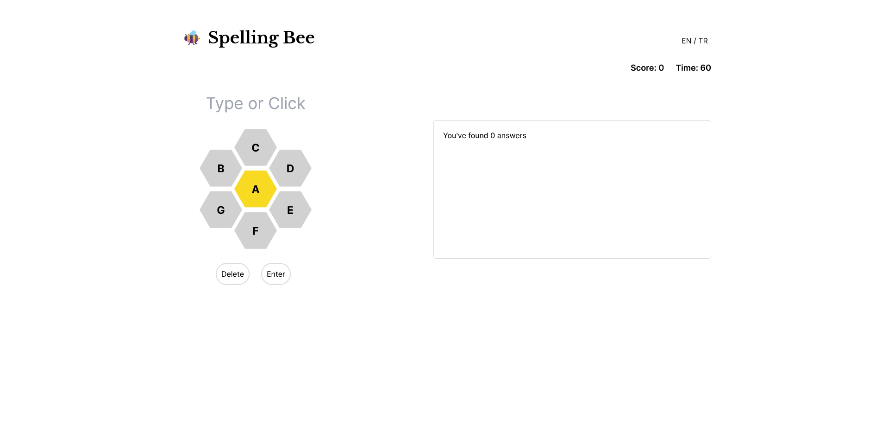
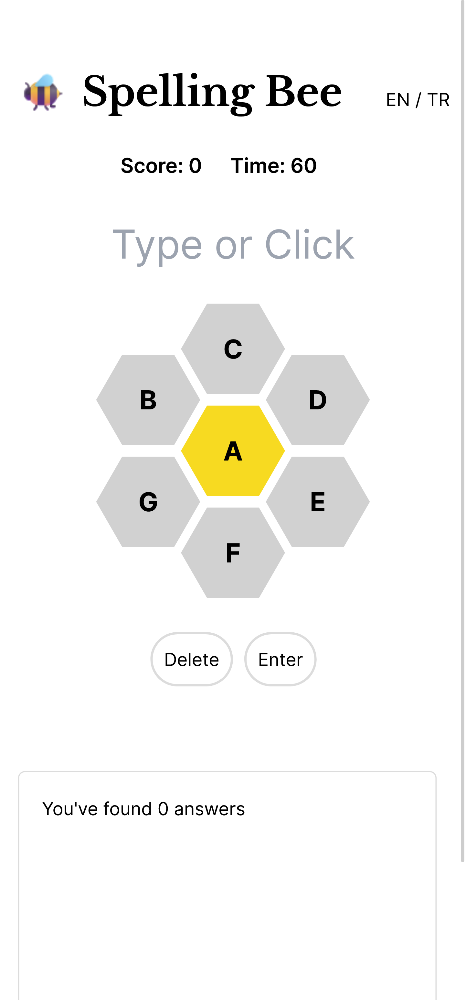

                  
 
<h1 align="center" style="font-weight: bold;">Spelling Bee Game 🐝</h1>

<p align="center">
<a href="#tech">Technologies</a>
<a href="#started">Getting Started</a>
 
</p>


<p align="center">Welcome to the Spelling Bee Game! This project is a fun and educational game where players can test their spelling skills by guessing words based on a set of letters.</p>


<p align="center">
<a href="https://spelling-bee-sage.vercel.app">📱 Visit The Project</a>
</p>
 
<h2 id="layout">🎨 Layout</h2>

<p align="center">



</p>
 
<h2 id="technologies">💻 Technologies</h2>

- Next
- React
- Responsive Design
- State Management
 
<h2 id="started">🚀 Getting started</h2>

follow these steps to get the project going locally.
 
<h3>Prerequisites</h3>

prerequisites necessary for running the project. 

- NodeJS
- Git 
 
<h3>Cloning</h3>

How to clone the project

```bash
git clone project-url-in-github
```
 
<h3>Starting</h3>

How to start the project

```bash
npm install

npm run dev
```
